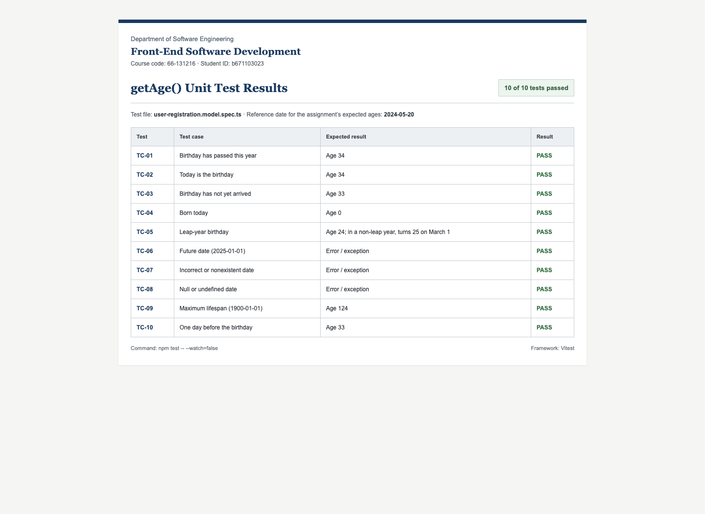

# FESD-FN-023

Student registration app for the **66-131216 Front-End Software Development** class. Built with Angular and Bootstrap 5; includes required-field validation, ISO date entry (`YYYY-MM-DD`), a registered-students table, and age calculation with ten unit tests.

## Run

```bash
npm install
npm start
```

## Test

```bash
npm test -- --watch=false
```

## Test result


